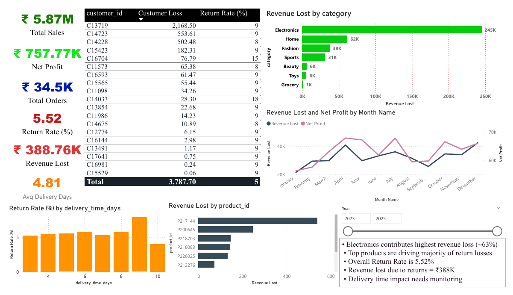

# 🛒 E-Commerce Return & Profit Leakage Analysis Dashboard

## 📌 Project Overview

This project analyzes **sales performance, product returns, and revenue loss in an e-commerce business** using an interactive dashboard built in **Microsoft Power BI**.

The objective of this project is to identify **profit leakage caused by product returns** and highlight important business insights such as:

* 📉 Categories contributing to the highest revenue loss
* 👥 Customers responsible for frequent returns
* 📦 Products driving major return losses
* 📅 Monthly trends in revenue loss and profit
* 🚚 Relationship between delivery time and return rate

The dashboard helps businesses understand **where revenue is being lost and what operational areas require improvement**.

---

# 📊 Dataset

The dataset used in this project was obtained from **Kaggle**.

It contains information related to:

* 🧾 Orders
* 👤 Customers
* 📦 Products
* 💰 Sales and Profit
* 🚚 Delivery Time
* 🔁 Product Returns

The dataset was imported as a **Excel file into Microsoft Power BI** for analysis and visualization.

---

# 🛠 Tools Used

* 📊 **Microsoft Power BI** – Data visualization and dashboard creation
* 📄 **Microsoft Excel Dataset** – Data source
* 🌐 **Kaggle** – Dataset provider

---

# ⚙️ Data Preparation Process

The following steps were performed in **Power BI**:

### 1️⃣ 📥 Data Import

The dataset was imported from a **Excel file downloaded from Kaggle**.

### 2️⃣ 🧹 Data Transformation

Using **Power Query Editor**, the dataset was prepared by:

* ✔️ Verifying column data types
* ✔️ Cleaning and organizing columns
* ✔️ Formatting date fields
* ✔️ Preparing the dataset for analysis

### 3️⃣ 📐 Creating Measures

Several **DAX measures** were created to calculate important metrics such as:

* 💰 Total Sales
* 📈 Net Profit
* 📦 Total Orders
* 🔁 Return Rate (%)
* 📉 Revenue Lost due to Returns
* 🚚 Average Delivery Days

These measures help summarize the dataset and provide **actionable insights**.

---

# 📊 Dashboard Features

The dashboard provides multiple analytical views to explore **sales performance and return patterns**.

### 🔹 📊 Key Performance Indicators (KPIs)

Important business metrics displayed in the dashboard:

* 💰 **Total Sales:** ₹5.87M
* 📈 **Net Profit:** ₹757.77K
* 📦 **Total Orders:** 34.5K
* 🔁 **Return Rate:** 5.52%
* 📉 **Revenue Lost due to Returns:** ₹388.76K
* 🚚 **Average Delivery Time:** 4.81 days

---

### 🔹 👥 Customer Return Analysis

Highlights customers responsible for **high revenue loss due to returns**, helping businesses identify **return patterns and potential risk customers**.

---

### 🔹 📦 Revenue Lost by Category

Identifies which **product categories generate the highest return-related revenue loss**.

Example insight:

* Electronics category contributes significantly to revenue loss.

---

### 🔹 📅 Monthly Revenue Loss vs Net Profit

A time-series analysis showing **monthly fluctuations in revenue loss and overall profit performance**.

This helps track **seasonal return patterns and financial trends**.

---

### 🔹 🚚 Delivery Time vs Return Rate

Analyzes the relationship between **delivery time and return behavior**, helping businesses understand whether **delayed deliveries impact product returns**.

---

### 🔹 📦 Product-Level Loss Analysis

Highlights **specific products responsible for the highest revenue loss due to returns**, enabling better inventory and product management decisions.

---

# 📷 Dashboard Preview

### 📊 Main Dashboard

---

# 💡 Key Insights

Some important observations from the analysis:

* 📉 Electronics category contributes the highest return-related revenue loss
* 📦 A small group of products accounts for a large portion of returns
* 🔁 Overall return rate is approximately **5.52%**
* 💰 Revenue lost due to returns is around **₹388K**
* 🚚 Delivery time may influence the likelihood of product returns

These insights help businesses **identify operational issues and improve decision-making**.

---

# 🚀 Business Value

This dashboard helps businesses:

* 📉 Identify profit leakage caused by product returns
* 📊 Monitor return rates and revenue losses
* 👥 Understand customer return behavior
* 📦 Identify high-risk products
* 📈 Track profit and performance trends

---

# 👩‍💻 Author

**Deeksha Mohan**
